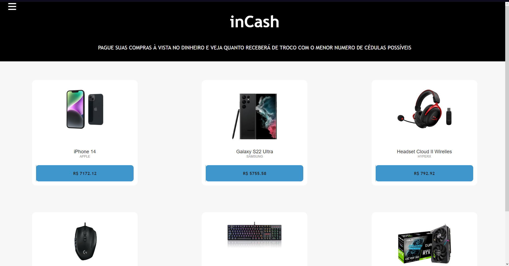
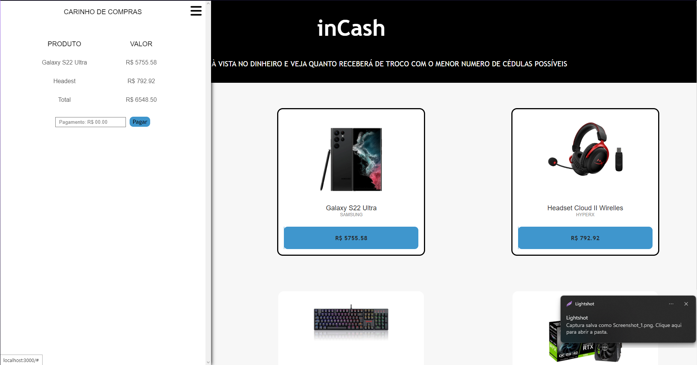

# inCash

**Número da Lista**: 28<br>
**Conteúdo da Disciplina**: Cashier's algorithm<br>

## Alunos
|Matrícula | Aluno |
| -- | -- |
| 19/0037997  |  Sidney Fernando F. Lemes |
| 21/2005426 |  Lucas Gomes Caldas |

## Sobre 
O projeto objetiva simular um carrinho de compra que deve ser pagado à vista e, dependendo do valor que é pago, o algoritmo calcula o troco e apresenta as notas e/ou moedas que devem ser dadas como troco.

## Screenshots
 <br>
 <br>
 <br>

## Instalação 
**Linguagem**: JavaScript e TypeScript<br>
**Front-end**: React.js<br>
**Back-end**: Node.js<br>
Instale o Node.js

## Uso
Na pasta docs, digite no terminal 
```npm install``` <br>
```npm start```

## Video
[Arquivo](img/video%20dupla%2028.mp4)
[Youtube](https://youtu.be/IhpwlY_vUJo)


